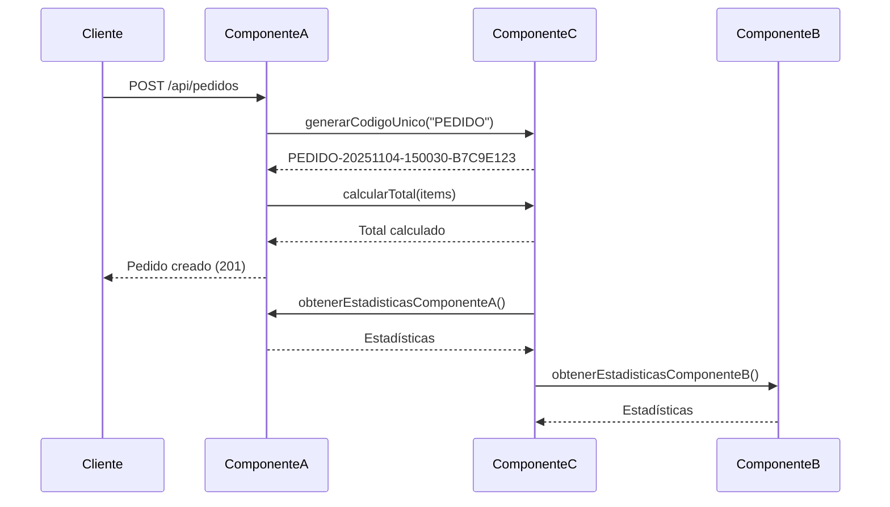

# Examen Final - Serie 2
## Sistema de Gestión de Logística con Microservicios

### 📋 Descripción del Proyecto

Sistema empresarial de logística que gestiona **clientes/pedidos** y **proveedores/facturas** mediante una arquitectura de microservicios con bases de datos heterogéneas y lógica compartida.

### 🏗️ Arquitectura

```
┌─────────────────┐                    ┌─────────────────┐
│  Componente A   │◄──── REST API ────►│  Componente B   │
│ (Spring Boot +  │                    │ (Spring Boot +  │
│    MariaDB)     │                    │   PostgreSQL)   │
└────────┬────────┘                    └────────┬────────┘
         │                                      │
         │          ┌──────────────┐           │
         └─────────►│ Componente C │◄──────────┘
                    │ (Maven Lib)  │
                    └──────────────┘
```

### 📦 Componentes

#### **Componente A - Spring Boot + MariaDB**
- Gestión de **Clientes** y **Pedidos**
- API REST documentada con OpenAPI 3
- Persistencia: JPA + MariaDB
- Puerto: `8081`

#### **Componente B - Spring Boot + PostgreSQL**
- Gestión de **Proveedores** y **Facturas**
- API REST documentada con OpenAPI 3
- Persistencia: JPA + PostgreSQL
- Puerto: `8082`

#### **Componente C - Biblioteca Maven Compartida**
- Dependencia JAR reutilizable
- Métodos utilitarios:
  - `calcularTotal(List<Producto>)`
  - `generarCodigoUnico(String tipoEntidad)`
  - Método de integración con API REST

### 🛠️ Tecnologías

- **Backend**: Java 17, Spring Boot 3.x, Maven
- **Bases de datos**: MariaDB, PostgreSQL
- **Documentación API**: OpenAPI 3 (Swagger)
- **Build**: Maven
- **Control de versiones**: Git

### 📂 Estructura del Proyecto

```
ExamenFINAL_Serie2/
├── componente-a/          # Spring Boot + MariaDB
├── componente-b/          # Spring Boot + PostgreSQL
├── componente-c/          # Maven Library
├── docs/                  # Especificaciones OpenAPI
│   ├── openapiA.yaml
│   └── openapiB.yaml
└── README.md
```

### 🚀 Instrucciones de Configuración

#### Prerrequisitos
- Java 17+
- Maven 3.8+
- MariaDB 10.x
- PostgreSQL 14+
- Git

#### 1. Clonar el repositorio
```bash
git clone https://github.com/csanchezzumg/ExamenFINAL_Serie2.git
cd ExamenFINAL_Serie2
```

#### 2. Compilar Componente C (dependencia compartida)
```bash
cd componente-c
mvn clean install
cd ..
```

#### 3. Configurar bases de datos

**MariaDB (Componente A)**
```sql
CREATE DATABASE logistica_clientes;
CREATE USER 'logistica_user'@'localhost' IDENTIFIED BY 'logistica_pass';
GRANT ALL PRIVILEGES ON logistica_clientes.* TO 'logistica_user'@'localhost';
FLUSH PRIVILEGES;
```

**PostgreSQL (Componente B)**
```sql
CREATE DATABASE logistica_proveedores;
CREATE USER logistica_user WITH PASSWORD 'logistica_pass';
GRANT ALL PRIVILEGES ON DATABASE logistica_proveedores TO logistica_user;
```

#### 4. Compilar todo el proyecto (opcional pero recomendado)
```powershell
.\build-all.ps1
```

#### 5. Ejecutar Componente A
```powershell
.\run-componente-a.ps1
```
O manualmente:
```bash
cd componente-a
mvn spring-boot:run
```
API disponible en: `http://localhost:8081`

#### 6. Ejecutar Componente B (en otra terminal)
```powershell
.\run-componente-b.ps1
```
O manualmente:
```bash
cd componente-b
mvn spring-boot:run
```
API disponible en: `http://localhost:8082`

> **Nota**: Los scripts PowerShell (`.ps1`) automatizan la compilación y ejecución. Si prefieres hacerlo manualmente, usa los comandos Maven directamente.

### 📚 Documentación API

- **Componente A (Swagger UI)**: http://localhost:8081/swagger-ui.html
- **Componente B (Swagger UI)**: http://localhost:8082/swagger-ui.html
- **OpenAPI Specs**: Ver carpeta `/docs`

### 🔄 Flujo de Integración

1. **Componente A** y **B** importan **Componente C** como dependencia Maven
2. Ambos componentes exponen APIs REST documentadas con OpenAPI 3
3. **Componente C** puede invocar endpoints de A o B para integración circular mediante `IntegracionService`
4. Comunicación entre componentes mediante REST API usando `ApiClient`

### 📊 Ejemplo de Flujo Completo



### 🎯 Características Implementadas

#### Componente C - Biblioteca Compartida
- ✅ Generación de códigos únicos con timestamp y UUID
- ✅ Cálculo de totales de productos
- ✅ Cálculo de impuestos (IVA 12%)
- ✅ Validación de códigos
- ✅ Cliente HTTP para integración REST (`ApiClient`)
- ✅ Servicio de integración circular (`IntegracionService`)

#### Componente A - Clientes y Pedidos
- ✅ CRUD completo de Clientes
- ✅ CRUD completo de Pedidos
- ✅ Relaciones JPA (Cliente → Pedidos → Items)
- ✅ Cálculo automático de totales e impuestos
- ✅ Validaciones con Bean Validation
- ✅ DTOs para transferencia de datos
- ✅ Documentación OpenAPI 3 completa
- ✅ Swagger UI integrado
- ✅ Actuator para health checks

#### Componente B - Proveedores y Facturas
- ✅ CRUD completo de Proveedores
- ✅ CRUD completo de Facturas
- ✅ Relaciones JPA (Proveedor → Facturas → Items)
- ✅ Cálculo automático de totales e impuestos
- ✅ Validaciones con Bean Validation
- ✅ DTOs para transferencia de datos
- ✅ Documentación OpenAPI 3 completa
- ✅ Swagger UI integrado
- ✅ Actuator para health checks

### 🧪 Pruebas de Integración

#### 1. Verificar Componente A
```bash
# Health check
curl http://localhost:8081/actuator/health

# Crear cliente
curl -X POST http://localhost:8081/api/clientes \
  -H "Content-Type: application/json" \
  -d '{"nombre":"Juan Pérez","email":"juan@example.com","telefono":"50212345678"}'

# Listar clientes
curl http://localhost:8081/api/clientes
```

#### 2. Verificar Componente B
```bash
# Health check
curl http://localhost:8082/actuator/health

# Crear proveedor
curl -X POST http://localhost:8082/api/proveedores \
  -H "Content-Type: application/json" \
  -d '{"nombre":"Tech Solutions","email":"info@tech.com"}'

# Listar proveedores
curl http://localhost:8082/api/proveedores
```

#### 3. Probar Integración Circular (Componente C)
El servicio `IntegracionService` en Componente C puede invocar:
- `obtenerEstadisticasComponenteA()` → Llama a `/api/clientes` del Componente A
- `obtenerEstadisticasComponenteB()` → Llama a `/api/proveedores` del Componente B

### 🚀 Comandos Rápidos

```powershell
# Compilar todo el proyecto
cd componente-c; mvn clean install; cd ..
cd componente-a; mvn clean package; cd ..
cd componente-b; mvn clean package; cd ..

# Ejecutar todos los componentes (en terminales separadas)
cd componente-a; mvn spring-boot:run
cd componente-b; mvn spring-boot:run

# Ver logs en tiempo real
cd componente-a; mvn spring-boot:run | Select-String "Started"
cd componente-b; mvn spring-boot:run | Select-String "Started"
```

### 📖 Documentación Adicional

- **Especificaciones OpenAPI**: Ver carpeta `/docs`
  - `openapiA.yaml` - Componente A
  - `openapiB.yaml` - Componente B
- **README por componente**:
  - `componente-a/README.md`
  - `componente-b/README.md`
  - `componente-c/README.md`

### 🎓 Buenas Prácticas Implementadas

1. **Arquitectura**:
   - Separación de responsabilidades (Controller → Service → Repository)
   - DTOs para desacoplar capa de presentación de dominio
   - Uso de interfaces JPA Repository

2. **Código**:
   - Validaciones con Jakarta Validation
   - Logging con SLF4J
   - Manejo de transacciones con `@Transactional`
   - Uso de Lombok para reducir boilerplate

3. **API**:
   - Documentación completa con OpenAPI 3
   - Códigos HTTP correctos (200, 201, 204, 400, 404)
   - Ejemplos en la documentación
   - Versionado semántico

4. **Git**:
   - Commits con Conventional Commits
   - Mensajes descriptivos
   - Commits atómicos por funcionalidad

### � Troubleshooting

#### Error de conexión a base de datos
```bash
# Verificar MariaDB
mysql -u logistica_user -p logistica_clientes

# Verificar PostgreSQL
psql -U logistica_user -d logistica_proveedores
```

#### Puerto ya en uso
```bash
# Verificar puertos en uso
netstat -ano | findstr :8081
netstat -ano | findstr :8082

# Cambiar puerto en application.properties
server.port=8083
```

#### Dependencia Componente-C no encontrada
```bash
# Reinstalar Componente-C
cd componente-c
mvn clean install
```

### �👨‍💻 Autor

**Carlos Sánchez**  
Universidad Mariano Gálvez - 2025  
Examen Final - Desarrollo Web

### 📝 Licencia

Proyecto académico - Universidad Mariano Gálvez
